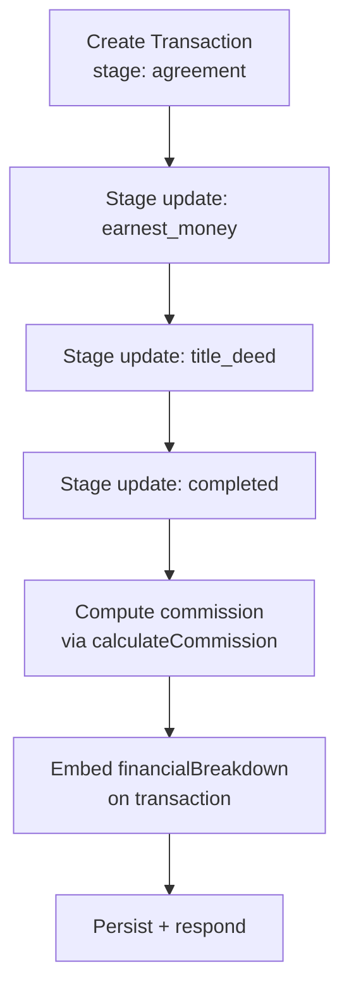

# DESIGN

## Architecture & Modules
- **Layers**: Controllers are thin; services hold business logic; Mongoose models are used directly (no repository layer). Global `ValidationPipe`, `HttpExceptionFilter`, `SuccessResponseInterceptor`.
- **Modules**: `transactions`, `agents`, `agencies`, plus root app. Each module exposes controller + service; services depend on Mongoose models defined in `/schemas`.
- **Database**: MongoDB (Atlas in production). Connection in `app.module.ts` via `connectDatabase`; `disconnectDatabase` on shutdown. Models: `AgentModel`, `AgencyModel`, `TransactionModel`.
- **API surface**:
  - `/transactions`: CRUD + `/transactions/:id/stage` for stage transitions.
  - `/agents`: CRUD.
  - `/agencies`: CRUD.
  - `/health`: liveness + DB state.
  - `/docs` + `/docs-json`: Swagger UI / OpenAPI.
- **Swagger**: Bootstrapped in `main.ts` with `@nestjs/swagger` + `swagger-ui-express`; open for review.
- **Validation**: Zod schemas via `ZodValidationPipe` per-route; global `ValidationPipe` for DTO coercion/whitelisting.

## Data Model & Business Rules
- **Agent**: `firstName`, `lastName`, `email` (unique), optional `phone`, `agencyId` (ObjectId ref).
- **Agency**: `name`, `officeEmail`, `officePhone`, `address?`, `commissionRate` (default 0.5 in logic).
- **Transaction**:
  - Links: `listingAgentId`, `sellingAgentId`, `agencyId`.
  - Fields: `propertyId`, `totalServiceFee`, `stage`, `stageLogs[]`, `financialBreakdown?`.
  - `stage` progression enforced in `TransactionsService.updateStage` with allowed order: `agreement` → `earnest_money` → `title_deed` → `completed`; **invalid/backward transitions are rejected** with `BadRequestException`.
  - **Financial breakdown**: stored **embedded** on the transaction when stage becomes `completed`; computed once via `calculateCommission` util and persisted with the stage log snapshot.
- **Commission policy** (embedded breakdown on completion):
  - Agency gets 50% (`agencyCommissionRate`, default 0.5).
  - Agent pool = remaining 50%.
  - If same agent for listing/selling: that agent gets 100% of agent pool.
  - If different: split agent pool equally (25% each given 50% pool).
  - Rationale: **Embedding** keeps reads simple and immutable for that stage snapshot; avoids recomputation per request. Alternatives rejected:
    - On-the-fly compute each read: slower and could drift if rules change.
    - Separate collection: adds joins/consistency concerns for this small scope.

## Error Handling & Responses
- Global `HttpExceptionFilter` normalizes errors.
- Global `SuccessResponseInterceptor` wraps responses with `{ success, message, data, meta?, timestamp, path, method }`.
- Stage transition guard throws `BadRequestException` on backward moves; missing records throw `NotFoundException`.

## Testing
- **Unit/Integration**: Jest.
- **Database isolation**: `mongodb-memory-server` as global setup; `jest-mongo-setup` / `jest-mongo-teardown` manage lifecycle; `jest-test-hooks` clears collections before each test. Integration specs use the global in-memory instance instead of spinning their own.
- **Coverage focus**: Commission calculation (`calculateCommission`), stage transitions, service CRUD paths, controller mappings. DTO validation covered via controller specs.

## Deployment Notes
- Targeted for Vercel/Render/Railway; requires `MONGO_URI` (Atlas) at runtime.
- Swagger/health live at `/docs`, `/docs-json`, `/health` on the deployed base URL.
- CORS not configured explicitly (can be enabled in `main.ts` if needed for a front-end).

## Risks / Trade-offs
- **Direct model usage**: Services talk directly to Mongoose models; no Nest `MongooseModule` schemas. Keeps code short but limits DI flexibility and makes mocking slightly more manual.
- **Embedded breakdown**: Snapshotting financial breakdown on completion avoids recomputation but requires recalculation if rules change; would need migration/rebuild jobs.
- **Global in-memory Mongo for tests**: Faster but may mask Atlas-specific behaviors (indexes, latency); acceptable for this scope.

## Next Steps (for production)
1) Add auth/roles (agents vs admins) and audit logging on stage changes and payouts.  
2) Event sourcing or outbox for stage transitions and payment instructions; integrate with payments.  
3) Configurable commission rules per agency (rule engine or per-agency overrides) with versioning.  
4) Observability: request logging, metrics, and alerts on failed transitions.  
5) Harden validation: schema-level enums reused in Swagger; stricter ObjectId validation in DTOs.  
6) Migrate to Nest `MongooseModule` for better DI/testing, add indexes (email unique, compound search).  
7) Rate limiting & CORS config for public endpoints; API keys for Swagger in non-dev.

## Diagram (stage + commission flow)

